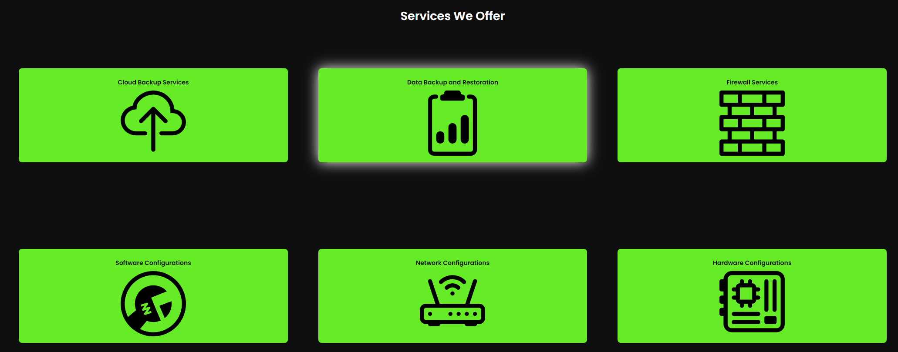

# IT WEBSITE
## PREVIEW OF MAIN PAGE


## Examples of animations in main page



##Run it Locally
```bash=
Download XAMPP and change the default index.php file
to the IT website index.php. To make it fully functonal
create an SQL database, also in XAMPP
```
